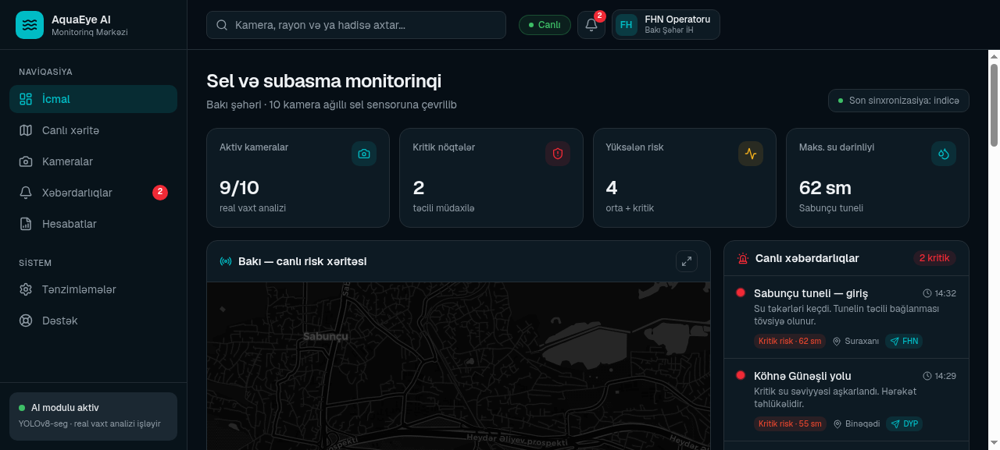
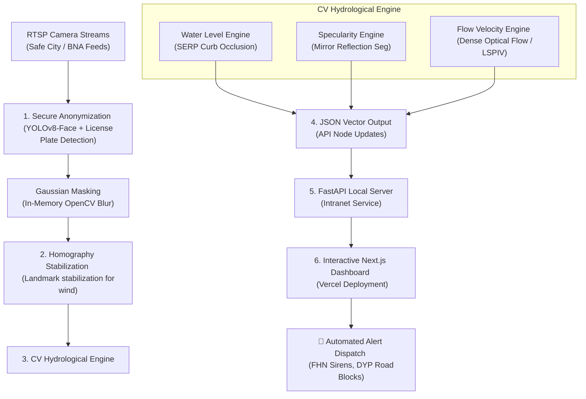

# 🏆 AquaEye AI — Smart City Flood Early Warning System

> **“We don't buy expensive hardware sensors for the city; we give intelligence to its existing cameras.”**

AquaEye AI is an advanced Software-as-a-Service (B2G SaaS) platform that transforms Baku’s extensive network of pre-existing traffic and surveillance CCTV cameras into a city-wide grid of virtual "smart flood sensors"—with **zero additional hardware cost**.

Using computer vision segmentation (YOLOv8-seg / YOLOv11-seg) and relative occlusion calculations, AquaEye AI estimates water depth in real-time, alerts emergency responders, and automates municipal pump trucks up to 30 minutes before severe urban flooding paralyzes key infrastructure.

---

## 📸 Interactive Command Dashboard

Below is a preview of the premium, high-fidelity command console built for city operators (DİN, FHN, AYNA):



---

## 🛠️ System Architecture & Data Flow

AquaEye AI functions as an end-to-memory pipeline, processing camera streams locally on secure servers to maintain public privacy while feeding alerts to the web dashboard.



---

## 🚦 The 3-Tier Risk Assessment System

The system operates on an automated, 3-tier safety matrix designed specifically for Baku's urban topology:

| Risk Level | Depth Range | Visual Indicator | Automated Action Dispatch |
| :--- | :--- | :--- | :--- |
| **🟢 LOW RISK** | 10–15 cm | **Green Alert** on Map | Logged for monitoring. Initial water accumulation on curbs. |
| **🟡 MEDIUM RISK** | 25–35 cm | **Yellow Alert** on Map | Auto-dispatch task to local municipal pump trucks to clear drains. |
| **🔴 CRITICAL RISK** | 50+ cm | **Red Flashing Alert** | Send emergency siren to FHN (Emergency Situations) & block road access via DYP. |

---

## 📂 Repository Codebase Structure

This monorepo is divided into a high-fidelity frontend application and a robust backend machine learning framework:

```filepath
AquaEye-AI/
├── app/                              # Next.js App Router (Pages, layouts, global styles)
│   ├── dashboard/                    # Main operator command view
│   ├── live-map/                     # Full-screen interactive Leaflet Baku map
│   └── api/                          # Next.js API endpoints / mock integrations
├── backend/                          # FastAPI Backend & Computer Vision Core
│   ├── app/
│   │   ├── api/v1/endpoints/        # Telemetry ingestion, alert triggers, vision analysis
│   │   ├── services/                 # YOLO anonymizers, hydrology, LSPIV optical flow engines
│   │   └── main.py                   # FastAPI app entry point
│   ├── tests/                        # Automated backend tests (pytest)
│   ├── Dockerfile                    # Production CUDA GPU container script
│   └── requirements.txt              # Python requirements
├── components/                       # Reusable UI widgets & layout wrappers
│   ├── aqua/                         # AquaEye-specific modules (Map, Charts, Alert Feeds)
│   └── ui/                           # Shancdn-based dark UI components
├── ideas/                            # Original hackathon pitches
│   ├── Openwave x Internal.pdf       # Strategic pitch PDF
│   └── idea.md                       # Core pitch overview
├── docs/                             # Guides & system architecture blueprints
│   ├── API_SPECIFICATION.md          # Detailed REST API payloads, curls and headers
│   ├── DEPLOYMENT_GUIDE.md           # On-premise air-gapped CUDA & K8s installation steps
│   ├── USER_GUIDE.md                 # Interactive map controls & override manuals
│   └── architecture/
│       ├── system_design.md          # Webhook loops & container design
│       └── ml_architecture_blueprint.md # Local GPU & SERP homography specs
├── research/                         # Completed Baku case studies & AI evaluations
│   └── completed/
│       ├── jobs_to_be_done_analysis.md # Target client needs (FHN, DİN)
│       ├── kotler_macro_analysis.md   # SWOT & PESTEL Absheron clay soil audits
│       ├── objection_preemptor_analysis.md # Preempting target municipal objections
│       ├── pitch_psychologist_analysis.md  # Psychographic pitch layouts
│       ├── jury_qna_defense.md        # Pre-compiled jury answers
│       ├── flood_detection_whitepaper.md # Mathematical LaTeX formulations
│       ├── baku_hydrology_case_study.md  # Sabunchu tunnel October flood metrics
│       └── gemini_multimodal_vision_eval.md # Benchmarking YOLO-seg vs LLaVA vs Gemini
├── assets/                           # Reorganized media and screenshots
│   ├── screenshots/                  # High-fidelity dashboard screenshots
│   └── video/                        # Baku CCTV flash flood timelapse demo video
├── infrastructure/                   # Multi-cloud IaC, Kubernetes & Cluster Deployment configs
│   ├── terraform/                    # AWS Fargate vpc, ecs, security and provider specs
│   ├── kubernetes/                   # Ingress, Service, ConfigMap, Secrets, and GPU limits manifests
│   ├── ansible/                      # Node provisioning and CUDA automation playbooks
│   ├── helm/                         # Release Chart & values configuration files
│   └── docker-compose.yml            # Multi-service local launch file (redis, pg, UI, backend)
├── .github/workflows/                # GitHub automated testing pipeline
│   └── ci.yml                        # Next.js compile & backend pytest pipeline
├── LICENSE                           # Proprietary Commercial License (safe-use only)
├── SECURITY.md                       # Intranet credentials & Volatile buffer security guides
├── public/                           # Static assets, camera thumbnails, and mock visuals
└── package.json                      # Next.js configuration & dependencies
```

---

## ⚙️ Running Locally & Deployment

### 1. Frontend (Next.js & React 19)
The dashboard uses Next.js and TailwindCSS v4 with dark glassmorphism styling.

```bash
# Install dependencies
npm install

# Run the development server
npm run dev
```
Open [http://localhost:3000](http://localhost:3000) to view the application.

#### 🚀 Vercel Deployment
The frontend is configured and optimized for 1-click deployment on **Vercel**:
*   Framework Preset: `Next.js`
*   Build Command: `npm run build`
*   Output Directory: `.next`

### 2. Backend (FastAPI & OpenCV)
See the [backend/README.md](file:///C:/Users/user/Desktop/AquaEye-AI/backend/README.md) for complete backend instructions.

```bash
cd backend
pip install -r requirements.txt
uvicorn app.main:app --reload
```

---

## 📈 Strategic Business & ML blueprints

For deep-dive reviews, explore our specialized design blueprints and market viability analyses:
*   📄 **Machine Learning Architecture Blueprint**: Details CUDA specs, Farneback Optical Flow, and YOLO configurations. Read [ml_architecture_blueprint.md](file:///C:/Users/user/Desktop/AquaEye-AI/docs/architecture/ml_architecture_blueprint.md).
*   📊 **Strategic Kotler Macro PESTEL/SWOT Analysis**: Read [kotler_macro_analysis.md](file:///C:/Users/user/Desktop/AquaEye-AI/research/completed/kotler_macro_analysis.md).
*   🎯 **Jobs-to-be-Done (JTBD) Framework**: Read [jobs_to_be_done_analysis.md](file:///C:/Users/user/Desktop/AquaEye-AI/research/completed/jobs_to_be_done_analysis.md).
*   💬 **Jury Q&A Defense & Objection Preemptor**: Expert guide prepared to address potential criticisms. Read [jury_qna_defense.md](file:///C:/Users/user/Desktop/AquaEye-AI/research/completed/jury_qna_defense.md) and [objection_preemptor_analysis.md](file:///C:/Users/user/Desktop/AquaEye-AI/research/completed/objection_preemptor_analysis.md).