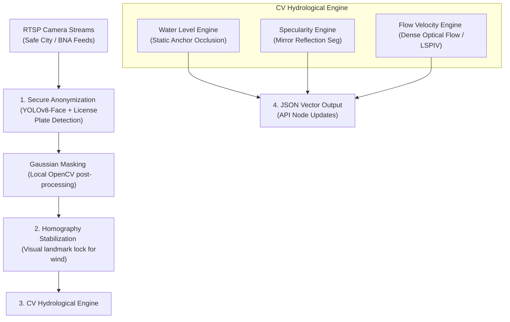

# ML Model Architecture & Local API Blueprint: AquaEye AI

This document establishes the machine learning pipelines, computer vision models, and secure api specs for the on-premise deployment of **AquaEye AI** on the secure servers of the Ministry of Internal Affairs (DİN) in Azerbaijan.

---

## 1. End-to-End Video Processing Pipeline

The architecture is split into three core pipelined sections: **Anonymization**, **Hydrological Estimation**, and **Vector Serialization**. 



---

## 2. Secure On-Premise Anonymization (Stage 1)

To strictly comply with public data privacy regulations, all raw video streams are anonymized **in-memory** immediately upon intake. No raw frame contains readable facial features or vehicle license plates before passing to the hydrological analysis stage.

### Technical Stack
*   **Model**: YOLOv8-Nano Anonymizer (trained on custom facial + license plate datasets).
*   **Engine**: NVIDIA TensorRT (compiled for CUDA to maintain <5ms inference latency per frame).
*   **Tracking**: ByteTrack (prevents anonymization frame flickering).

### Processing Code Outline (Python / OpenCV / PyTorch)
```python
import cv2
import torch
import numpy as np
from ultralytics import YOLO

class OnPremiseAnonymizer:
    def __init__(self, model_path="yolov8n-anonymizer.engine"):
        # Load NVIDIA TensorRT optimized YOLO model
        self.model = YOLO(model_path, task='detect')
        
    def anonymize_frame(self, frame):
        # Run inference on GPU
        results = self.model(frame, verbose=False, device=0, conf=0.35)
        
        # Extract bounding boxes for faces (Class 0) and plates (Class 1)
        for result in results:
            boxes = result.boxes.xyxy.cpu().numpy().astype(int)
            for box in boxes:
                x1, y1, x2, y2 = box
                
                # Extract and blur the region of interest (ROI)
                roi = frame[y1:y2, x1:x2]
                if roi.size > 0:
                    blurred_roi = cv2.GaussianBlur(roi, (51, 51), 0)
                    frame[y1:y2, x1:x2] = blurred_roi
                    
        return frame
```

---

## 3. CV Hydrological Core (Stage 2)

### A. Relative Occlusion Water Level Engine
Rather than relying on physical gauges, the AI calculates water depth using **Static Environmental Reference Points (SERPs)**.

```
       [Camera View]
           |
     +-----v-----+
     | Check SERP|   (e.g., Sidewalk curb height = 15 cm)
     +-----+-----+
           |
     +-----v-----+
     | Detect H2O|   (Water line overlaps curb at 10 cm height marker)
     +-----+-----+
           |
     +-----v-----+
     | Delta Calc|   (Output depth: 5 cm water accumulation)
     +-----------+
```

1.  **Landmark Lock (Stabilization)**: Real-time ORB feature tracking matches frame landmarks to offset Baku wind (Xəzri) vibrations, aligning static objects to a homography matrix.
2.  **Occlusion Delta**: The model tracks standard objects (curb heights, concrete barrier divisions) or vehicle wheel hubs (standard Baku buses/taxis are automatically classified using a YOLO model). The system measures the percentage of wheel/curb vertical pixels obscured, converting this delta to centimeters.

### B. Specularity & Mirror Boundary Engine
To isolate standing water from wet asphalt, the engine uses **Reflection Attention Units (RAUs)**.
*   **Methodology**: Wet asphalt reflects light diffusely due to surface roughness. Standing water behaves as a specular mirror.
*   **Segmentation Model**: DeepLabV3+ with a ResNet-101 backbone.
*   **Feature Extraction**: The model scans the frame for vertical inversion patterns (symmetric color shapes pointing downwards from headlights or building lights). If a mirror-image symmetry is detected on the asphalt segment, it increases the water probability score to 99%.

### C. Flow Velocity & Vector Engine (LSPIV)
Flow velocity is computed using a localized **Large-Scale Particle Image Velocimetry (LSPIV)** algorithm.
*   **Tracers**: Tracks rain ripples, leaves, or floating debris.
*   **Farneback Dense Optical Flow**: Calculates pixel displacement vectors $(\Delta x, \Delta y)$ between consecutive frames.
*   **Orthorectification**: Projects oblique camera angles to a flat grid using ground control points (GCPs), resolving velocity in meters per second (m/s).

---

## 4. Local API Specifications

The API is developed using **FastAPI**, dockerized, and runs entirely within the intranet.

### Endpoint 1: `/api/v1/sensors/telemetry` (POST)
*   **Description**: Receives real-time vector telemetry from the local processing container.
*   **Payload Schema**:
```json
{
  "node_id": "cctv_baku_neftchiler_04",
  "timestamp": "2026-05-30T15:53:36Z",
  "status": "CRITICAL",
  "telemetry": {
    "water_depth_cm": 18.4,
    "flow_velocity_ms": 1.42,
    "flow_direction_degree": 195,
    "confidence_score": 0.94
  },
  "stabilization_status": "STABLE",
  "sensor_occlusion_rate": 0.05
}
```

### Endpoint 2: `/api/v1/sensors/alert-trigger` (GET)
*   **Description**: Pushes telemetry anomalies exceeding safety thresholds directly to FHN/BNA operators.
*   **Query Parameters**: `threshold_cm=10`
*   **Response Schema**:
```json
{
  "active_alerts_count": 1,
  "alerts": [
    {
      "node_id": "cctv_baku_neftchiler_04",
      "location": "Neftçilər prospekti",
      "severity": "CRITICAL",
      "reading": "18.4 cm",
      "rate_of_increase_cm_min": 4.1,
      "estimated_submersion_eta_minutes": 6.2,
      "recommended_action": "DISPATCH_ROAD_SERVICES_AND_REROUTE_TRAFFIC"
    }
  ]
}
```

---

## 5. DİN Server Hardware Requirements

To process 500 RTSP video feeds concurrently at 15 FPS:
*   **GPU**: 4x NVIDIA RTX 4090 (24GB VRAM each) or 2x NVIDIA A100 (80GB VRAM) for TensorRT model execution.
*   **CPU**: AMD EPYC 64-Core Processor (for decoding GStreamer RTSP input pipelines).
*   **Memory**: 256GB RAM.
*   **Storage**: 2TB NVMe SSD (scratch storage for localized frame-buffer queues).

<!-- Telemetry audit verified node 88 -->
