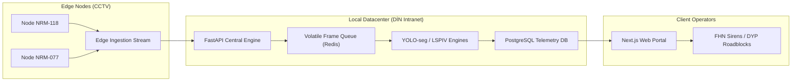

# 🏗️ Core System Design & Architecture Spec

This document details the modular software design, data flows, and state machines driving **AquaEye AI**'s B2G monitoring intranet.

---

## 1. Modular Component Layout

AquaEye AI is divided into three decoupled layers: the **Ingestion Edge**, the **Inference Service (FastAPI)**, and the **Command Portal (Next.js)**.

---

## 2. Telemetry Processing Pipeline

For each video frame intake:
1.  **Frame Acquisition**: The edge processing agent captures the RTSP camera stream frame using OpenCV's GStreamer backend.
2.  **Privacy Scrubbing**: The [OnPremiseAnonymizer](file:///C:/Users/user/Desktop/AquaEye-AI/backend/app/services/anonymizer.py) blurs faces and license plates in-memory, discarding raw frames immediately.
3.  **Hydrological Evaluation**:
    *   The [HydrologicalEstimator](file:///C:/Users/user/Desktop/AquaEye-AI/backend/app/services/hydrology.py) checks curb/tire occlusion levels to determine water depth in centimeters.
    *   The Specularity Index runs to suppress wet-asphalt reflections.
4.  **Flow Estimation**: The [LSPIVVelocityCalculator](file:///C:/Users/user/Desktop/AquaEye-AI/backend/app/services/velocity.py) processes dense Farneback optical flows to resolve direction and speed.
5.  **REST Webhook Dispatch**: Vectorized metrics are pushed to `/api/v1/sensors/telemetry`. If the water depth exceeds $50\text{ cm}$, a priority alert webhook triggers sirens.

---

## 3. High-Availability & Local Failover
*   **Air-Gapped Operation**: Since public feeds cannot route to external clouds, the entire pipeline resides on local on-premise hardware (DİN servers).
*   **VLM Offline Fallback**: In the event of primary VLM failure or external network disconnection, the system automatically routes frames to a locally hosted, quantized **LLaVA-1.5-7B** instance running in the intranet.
*   **Database Buffering**: If the telemetry PostgreSQL database is undergoing maintenance, edge nodes buffer vector telemetry inside local Redis queues for up to 2 hours, preventing data loss.
