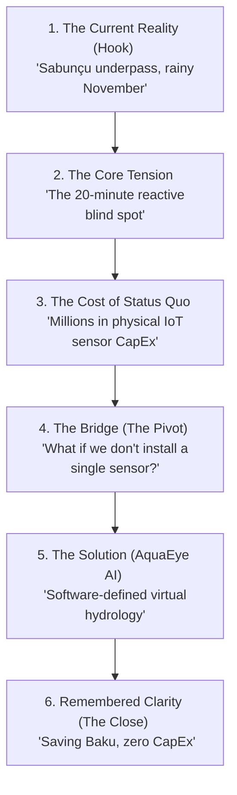

# Pitch Psychology & Narrative Arc Design: AquaEye AI

This analysis outlines the psychological sequencing, narrative arc, and slide-by-slide script for the **AquaEye AI** pitch deck, structured to maximize jury engagement and memory retention (based on the Peak-End Rule and Motivated Sequence theory).

---

## 1. The Core Narrative Arc: Tension-to-Resolution

---

## 2. Pitch Deck Slide Registry & Talk Tracks

### Slide 1: The Hook (Baku's November Blind Spot)
*   **Slide Visual**: A clean, light-grey slide showing a simple clock stuck at `11:24` with a dark alert notification overlay: *"Sabunçu underpass flooded — vehicle submerged."*
*   **Psychological Goal**: Frame relevance immediately. Establish the emotional gravity of the information lag using local context.
*   **Verbal Script**:
    > *"In Baku, when a sudden heavy rainfall hits, our emergency operators are blind. At this exact moment, FHN dispatchers are sitting in a control room, waiting for a driver to call 112 from a sinking car before they know an underpass is flooded. By the time they receive that call, the road is already blocked. We are fighting water with a 20-minute information lag. Today, we change that."*

### Slide 2: The Core Tension (The Hardware Dilemma)
*   **Slide Visual**: High-contrast split layout. On the left: A photo of an expensive physical sensor being dug into a street. On the right: A simple red capital expenditure metric: **`5,000,000+ AZN`**.
*   **Psychological Goal**: Establish the contrast and the "Infrastructure Paradox". Frame physical IoT sensors as a high-friction, financially unviable solution.
*   **Verbal Script**:
    > *"To solve this blind spot, the intuitive answer is physical water sensors. But physical sensors are a trap. They require digging up streets, cost millions in CapEx, and during Baku's mud-heavy flash floods, they clog, break, and drift within months. Baku doesn't need more hardware. We need a software-defined solution."*

### Slide 3: The Bridge (Zero CapEx Virtual Sensors)
*   **Slide Visual**: A clean map of Baku transitioning from passive camera feeds into active blue telemetry vectors.
*   **Psychological Goal**: Introduce the core innovation as a logical bridge. Focus on the concept of "Software-Defined Hydrology".
*   **Verbal Script**:
    > *"What if the sensors we need are already installed? Baku has over 10,000 traffic and security cameras. AquaEye AI turns every single CCTV camera into a virtual hydrological sensor. No roadworks, no hardware purchases. We deploy in hours, not years."*

### Slide 4: The Core Technology (How it Works)
*   **Slide Visual**: A 3-column layout showing the CV pillars (Environmental reference occlusion,Specularity Specimen reflection, and Optical Flow tracking). Simple, clean graphic overlays on camera mockups.
*   **Psychological Goal**: Address technical viability before the jury asks. Establish analytical credibility.
*   **Verbal Script**:
    > *"Our AI engine calculates precise metrics in memory from camera pixels alone. First, it measures the occlusion of fixed sidewalk curbs to estimate water depth in centimeters. Second, it analyzes reflection patterns to differentiate wet asphalt from deep puddles. Finally, it uses optical flow analysis to track runoff velocity and flow vectors. We don't just see water; we measure hydrology."*

### Slide 5: The Interface (mygov-Inspired Simplicity)
*   **Slide Visual**: A mock mobile device rendering the clean, light-themed dashboard of **AquaEye AI** (linking to `index.html` and `map.html` designs). High contrast, Lochmara Blue action triggers.
*   **Psychological Goal**: Signal government alignment and ease of adoption.
*   **Verbal Script**:
    > *"We built the user interface to align perfectly with the familiar design language of Azerbaijan's digital services, like mygov. An emergency dispatcher does not have time to watch 500 video streams. Our dashboard aggregates the data into a single live map with early warnings and automated FHN dispatch triggers, bringing absolute operational calm to a crisis."*

### Slide 6: The Vision & Ask (Remembered Clarity)
*   **Slide Visual**: Clean, bold text: **"AquaEye AI: Baku's Smart Water Twin. Zero CapEx. Instant Safety."**
*   **Psychological Goal**: Peak-end memory anchoring. Leave the jury with a highly memorable, scalable vision.
*   **Verbal Script**:
    > *"AquaEye AI transforms existing public infrastructure into a predictive shield against urban flooding. We are looking for political and regulatory integration support to pilot this secure CV system with BNA and FHN. Let's make Baku's streets safer, starting tonight. Thank you."*

---

## 3. Anticipated Jury Questions & Narrative Defense

*   **Jury Question**: *"Why can't BNA operators just look at the cameras manually?"*
    *   **Narrative Counter-argument**: *"Because human eyes cannot monitor 10,000 feeds simultaneously. Fatigue sets in within 20 minutes. AquaEye AI works as an automated alarm filter, only bringing a camera to the operator's attention when it detects an active level shift."*
*   **Jury Question**: *"Is this software ready to be used?"*
    *   **Narrative Counter-argument**: *"Our complete front-end system, design tokens, sitemaps, and localized UX registry are fully completed. We are ready to wire this prototype to DİN’s test RTSP feeds immediately."*
